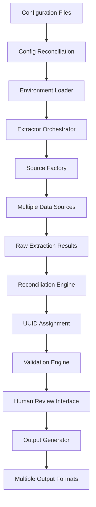

# Common Dictionary Module: Comprehensive Analysis

## Business Need & Purpose

The Common Dictionary module addresses a critical problem in scientific data management, specifically in chemistry: **the fragmentation and inconsistency of chemical knowledge across multiple data sources**. Scientists and researchers struggle with:

1. **Data Silos**: Chemical data is scattered across different databases (PubChem, ChEBI, Reaxys, etc.)
2. **Inconsistent Quality**: Different sources have varying levels of accuracy and completeness
3. **Lack of Provenance**: No clear tracking of where data originated and how reliable it is
4. **Manual Integration**: Researchers spend significant time manually reconciling conflicting information
5. **No Standardization**: Different systems use different schemas, units, and formats

## High-Level Design Philosophy

The system follows several key design principles:

### 1. Modular Pipeline Architecture
```
Config Reconciliation → Extraction → Reconciliation → UUID Assignment → Validation → Enrichment → Human Review → Output
```

### 2. Configuration-Driven Approach
- **Schema Separation**: Entity structure definitions are completely separated from data instances
- **Environment Awareness**: Support for development, testing, staging, and production environments
- **No Hard-Coded Values**: All behavior is driven by YAML configuration files

### 3. Provenance-First Design
- Every piece of data tracks its source, confidence level, timestamp, and extraction method
- Multiple source values are preserved, not just the "winner"
- Full audit trail for human review decisions

### 4. Standards Compliance
- SI units validation via Pint library and NIST standards
- JSON Schema validation for all data structures
- Industry best practices for chemical data representation

## Core Components & Architecture

### 1. Configuration Management System
- **`config_reconciliation.py`**: Validates consistency across all configuration files
- **Environment Loader**: Automatically detects and loads environment-specific configurations
- **Multi-file Strategy**: Separates concerns across specialized YAML files:
  - `entity_config.yaml`: Entity schemas and validation rules
  - `extraction_config.yaml`: Data source connection details
  - `source_mapping.yaml`: Attribute-to-source priority mappings
  - `conflict_resolution.yaml`: Rules for handling conflicting data
  - `ontology.yaml`: Entity type hierarchy and relationships

### 2. Pluggable Extraction Framework
- **Source Factory Pattern**: Easy addition of new data sources without code changes
- **Base Source Interface**: Standardized contract for search-based and key-based extraction
- **Implemented Sources**: 
  - PubChem API integration
  - RDKit computational chemistry
  - CSV/file-based sources
  - Extensible to databases, web scraping, etc.

### 3. Data Processing Pipeline
- **Search-Based Extraction**: Query sources with filters and extract multiple records
- **Key-Based Extraction**: Look up specific entities by identifier (SMILES, CID, etc.)
- **Reconciliation**: Merge data from multiple sources using priority rules
- **UUID Assignment**: Generate unique identifiers for deduplicated entities
- **Validation**: Schema, value range, unit, and cross-field validation

### 4. Human-in-the-Loop Review
- **Streamlit Interface**: Web-based UI for reviewing extracted data
- **Provenance Display**: Shows all source values and alternatives for each attribute
- **Approval Workflow**: Humans can approve, override, or edit values
- **Audit Trail**: All review decisions are logged with timestamps

### 5. Multi-Format Output Generation
- **JSON**: Structured data with full provenance
- **CSV/TSV**: Flat tables for data analysis
- **HTML**: Human-readable reports with CID grouping
- **Schema-Driven**: Output format controlled by configuration

## Key Technical Innovations

### 1. Multi-Source Reconciliation Strategy
Instead of simply overriding conflicting values, the system:
- Preserves all source values with their provenance
- Uses configurable priority rules to select canonical values
- Allows human reviewers to see all alternatives
- Maintains confidence scores for each extraction

### 2. Environment-Aware Configuration
- Automatic environment detection (development/staging/production)
- Environment-specific configuration templates
- Override mechanisms for testing and development
- Validation that ensures config consistency across environments

### 3. Schema-Instance Separation
- Entity schemas define structure and validation rules
- UUIDs are assigned to instances, never hard-coded in schemas
- Clean separation between "what can exist" vs "what does exist"
- Enables schema evolution without breaking existing data

### 4. Extensible Source Integration
- Plugin architecture for data sources
- Standardized BaseSource interface
- Support for both real-time API calls and batch processing
- Configurable retry logic, timeouts, and error handling

## Domain-Specific Intelligence (Chemistry)

The system demonstrates deep understanding of chemistry requirements:

### Chemical Entity Modeling
- **Compound hierarchy**: Organic compounds, polymers, metal complexes
- **Multiple identifier systems**: SMILES, InChI, CID, ChEBI ID
- **Structure-aware processing**: Integration with RDKit for molecular computations
- **Unit standardization**: Molecular weight, melting points, etc. with proper units

### Chemical Data Sources
- **PubChem**: Primary source for compound properties
- **ChEBI**: Chemical entities of biological interest
- **RDKit**: Computational chemistry and molecular descriptors
- **Extensible**: Easy to add Reaxys, SciFinder, proprietary databases

### Chemical Relationships
- Compound-Reaction relationships
- Catalyst-Process mappings
- Solvent-Application linkages
- Structure-Property correlations

## Quality Assurance & Validation

### Multi-Layer Validation
1. **Config Reconciliation**: Ensures all configurations are consistent
2. **Schema Validation**: JSON Schema validation for all data structures
3. **Value Validation**: Range checks, format validation, unit validation
4. **Cross-Field Validation**: Ensures related fields are consistent
5. **Human Review**: Final validation by domain experts

### Error Handling & Robustness
- Graceful handling of API failures and timeouts
- Retry logic with exponential backoff
- Comprehensive logging and error reporting
- Fail-fast validation to catch issues early

## Deployment & Scalability Considerations

### Environment Management
- Docker-compatible with conda environment management
- Support for multiple deployment environments
- Configuration templates for easy setup
- Environment variable injection for secrets

### Performance Optimization
- Batch processing for API efficiency
- Configurable result limits and pagination
- Caching strategies for repeated queries
- Parallel processing capability

## Future Extensibility

The architecture is designed for growth:

### Domain Expansion
- Easy addition of new scientific domains (biology, materials science)
- Domain-specific configuration isolation
- Shared infrastructure and patterns

### Advanced Features
- Machine learning integration for automated conflict resolution
- Real-time data streaming from multiple sources
- Advanced visualization and analytics
- Integration with knowledge graphs and semantic web technologies

## Implementation Details

### Configuration Files Structure
```
config/
  domains/
    chemistry/
      ontology.yaml              # Entity type hierarchy and relationships
      entity_config.yaml         # Entity schemas and validation rules
      extraction_config.yaml     # Data source connection details
      source_mapping.yaml        # Attribute-to-source priority mappings
      conflict_resolution.yaml   # Rules for handling conflicting data
      validation_config.yaml     # Validation rules and constraints
      relationships_config.yaml  # Relationship definitions
```

### Source Code Organization
```
src/
  config_reconciliation.py       # Configuration validation and consistency
  config/
    env_loader.py               # Environment-aware configuration loading
    config_loader.py            # Centralized configuration management
  domains/
    chemistry/
      extractor.py              # Main extraction orchestrator
      output_generator.py       # Multi-format output generation
      sources/
        base_source.py          # Abstract base class for sources
        pubchem_source.py       # PubChem API integration
        rdkit_source.py         # RDKit computational chemistry
        source_factory.py       # Plugin registry for sources
```

### Data Flow Architecture


## Key Benefits

### For Researchers
- **Single Point of Access**: Query multiple chemical databases through one interface
- **Quality Assurance**: Confidence scores and provenance for all data
- **Conflict Resolution**: Intelligent handling of contradictory information
- **Standards Compliance**: Consistent units and formats across all sources

### For Organizations
- **Scalability**: Modular architecture supports growing data needs
- **Maintainability**: Configuration-driven behavior reduces code complexity
- **Extensibility**: Easy addition of new data sources and domains
- **Compliance**: Full audit trails and validation for regulatory requirements

### For Developers
- **Plugin Architecture**: Add new sources without modifying core code
- **Environment Management**: Seamless deployment across different environments
- **Comprehensive Testing**: Validation at multiple levels ensures reliability
- **Documentation**: Extensive documentation and clear code structure

## Summary

The Common Dictionary module represents a **production-ready, enterprise-grade solution** for scientific data integration. It combines:

- **Industrial software engineering practices** (modular design, comprehensive testing, configuration management)
- **Domain expertise** (chemistry-specific modeling and data sources)
- **Research-grade rigor** (provenance tracking, validation, human oversight)
- **Operational excellence** (environment management, error handling, scalability)

The result is a system that can **reliably extract, reconcile, and curate chemical knowledge** from multiple sources while maintaining full traceability and enabling human oversight—exactly what's needed for high-stakes scientific applications where data quality and provenance are paramount.

This architecture serves as a blueprint for similar systems in other scientific domains, demonstrating how to build robust, scalable, and maintainable data integration platforms that meet the stringent requirements of scientific research and industry applications.